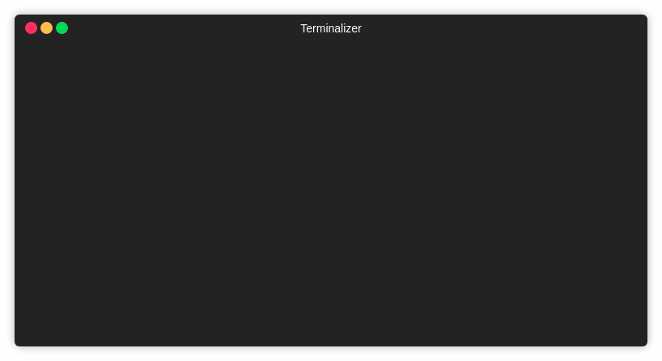

# Blih Cheated
A more advanced remake of Blih (Bocal Lightweight Interface for Humans), EPITECH's tool for repo gestion in NodeJS.
## Features
- User & Password saved in a config file (``~/.blihrc``, password is encrypted)
- Ability to clone a repo (even multiple repos) straight from the tool.
- Prepare command included
- A more user-friendly (ish) interface
- All features from the original blih tool
## Installation
```
# Installs zblih
$ git clone https://github.com/zaub1/blih_cheated
$ sudo ./install.sh
```
## Example

## Usage
```
• repo | repository -- Allows for repository managment
• who -- In case you forgot who you are, it prints it.
• userlogout -- Logs out current user in order to use the tool as another one
• sshkey -- Upload the SSH key specified in param
```
### Repo command usage
```
• create -- Creates a repo on EPITECH's servers
• list -- Lists your repos on EPITECH's servers
• delete -- Deletes the specified repo
• setacl -- Allows to set permission to users on the repo
• getacl -- Shows users perms on the repo
• prepare -- Creates, Set default ACLs, Clones
• clone -- Clones the specified repos (yes you can clone multiple at once)
```
